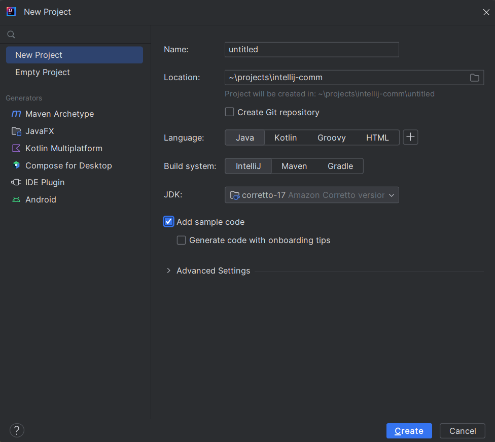
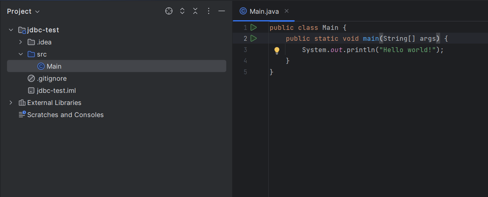
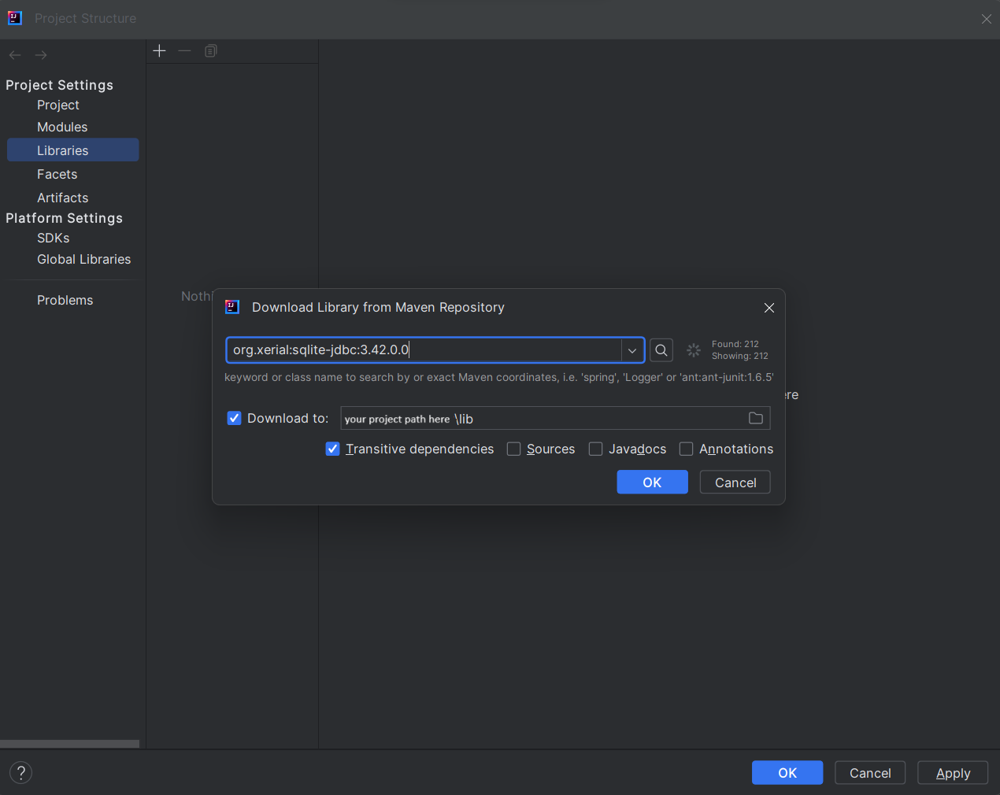
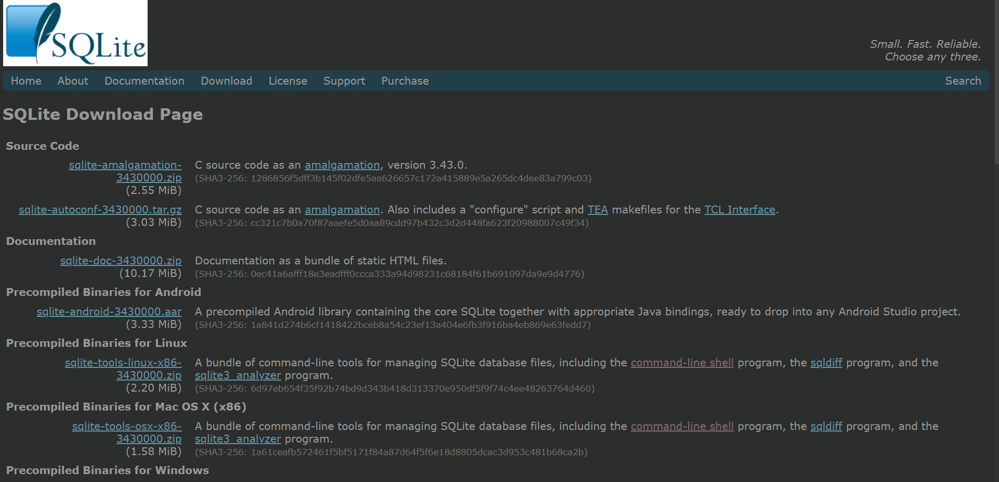
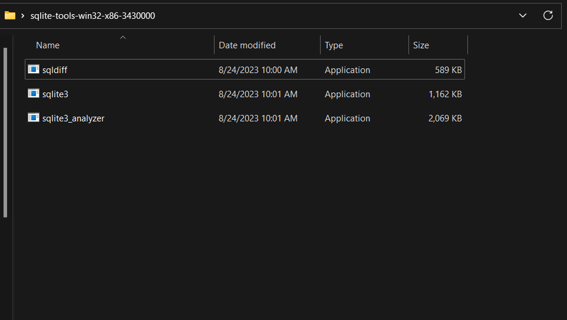
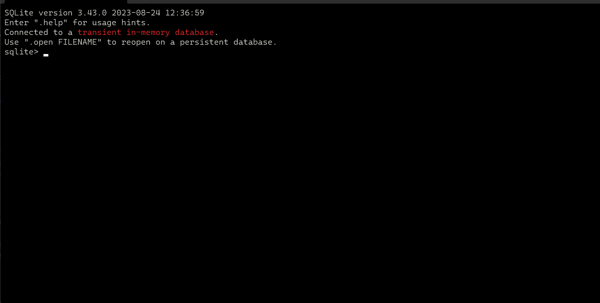
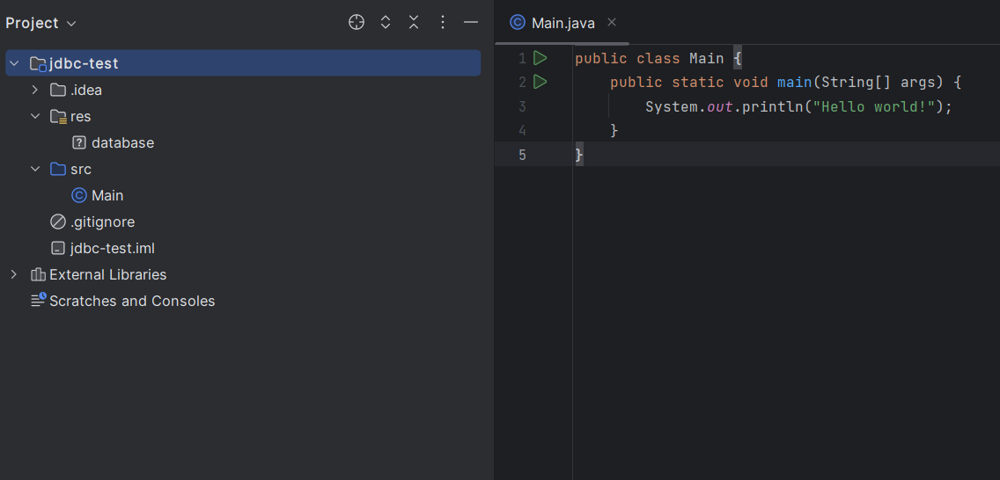

## IntelliJ Community + JDBC + SQLITE

(or any other database)

- no build tool required (Maven or Gradle)
- we'll be downloading the sqlite command-line shell (https://www.sqlite.org/cli.html)
    - this will make it easy to create a database file and use it as our connection in jdbc.
- sqlite drivers from ([org.xerial.sqlite](https://github.com/xerial/sqlite-jdbc))

<style>
    .img {
        width: 500px;
        position: relative;
        right: calc(50% -250px);
        justify-content: center;
    }
</style>

### Step 1: Project Setup

1.1 create a new project

`File > New > Project..`




click on `New Project`
pick a name for your project (we will be calling it _jdbc-test_)
click `Create`

1.2 adding the sqlite driver




once your new project is created go to

```File > Project Structure > Libraries```

click the + sign and then Maven
(you could also download the jar yourself
[sqlite driver jar](https://github.com/xerial/sqlite-jdbc/releases),
Maven just does it for you)



- search for `org.xerial.sqlite-driver` and use the latest version (3.42.0.0 as of this commit)
- _optional_: you can choose to store your library in a `lib` folder for organizational purposes.
- click okay to add the dependency.

### Step 2: Getting a Database File with the SQLite

2.1 downloading the tool



visit the [sqlite downloads page](https://www.sqlite.org/download.html)
install the precompiled binaries for your target OS

- make sure your download has the following description:

> A bundle of command-line tools for managing SQLite database files,
> including the command-line shell program, the sqldiff.exe program,
> and the sqlite3_analyzer.exe program.
>

2.1 identifying your tools



- unzip the downloaded folder and view the contents inside.
- you should see `sqldiff`, `sqlite3`, and `sqlite3_analyzer`.
- you are only interested in **sqlite3** for now.
- start sqlite3

2.3 using sqlite3 cli



- to create a new database file simply type

  ```.save [name-of-database-file]```

- this will create a new file in the same folder as the sqlite3 application.

2.4 handling the database resource file

- move the file into your IntelliJ Community Edition project.
- you can store in the root directory or in some resource folder



### Step 3: Using JDBC and SQLite

you are now ready to start using Sqlite and JDBC!

- you can learn how to use JDBC through the following resources:
    - https://docs.oracle.com/javase/tutorial/jdbc/basics/index.html
    - https://www.baeldung.com/java-jdbc

look through the source code for a quick example using our newly created database file.
